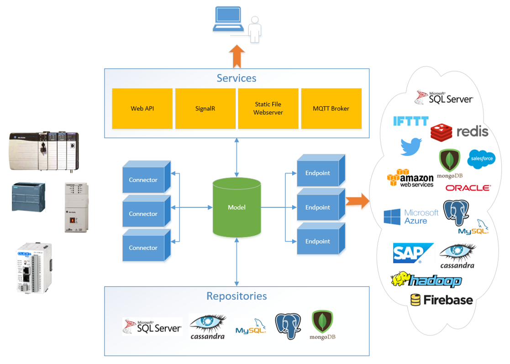
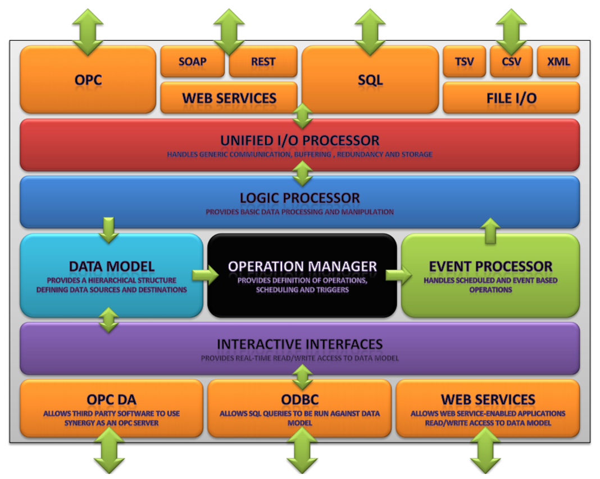
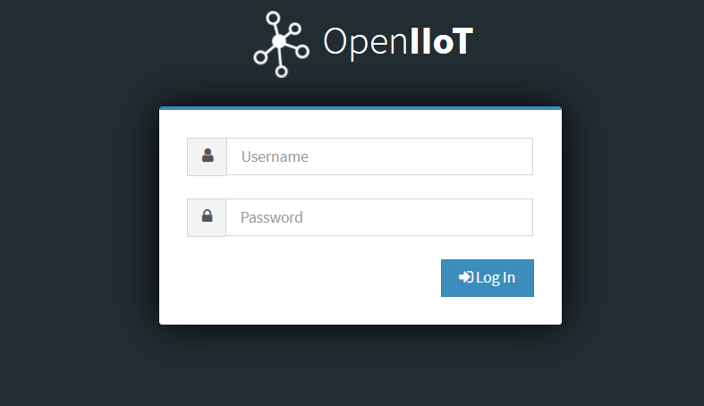
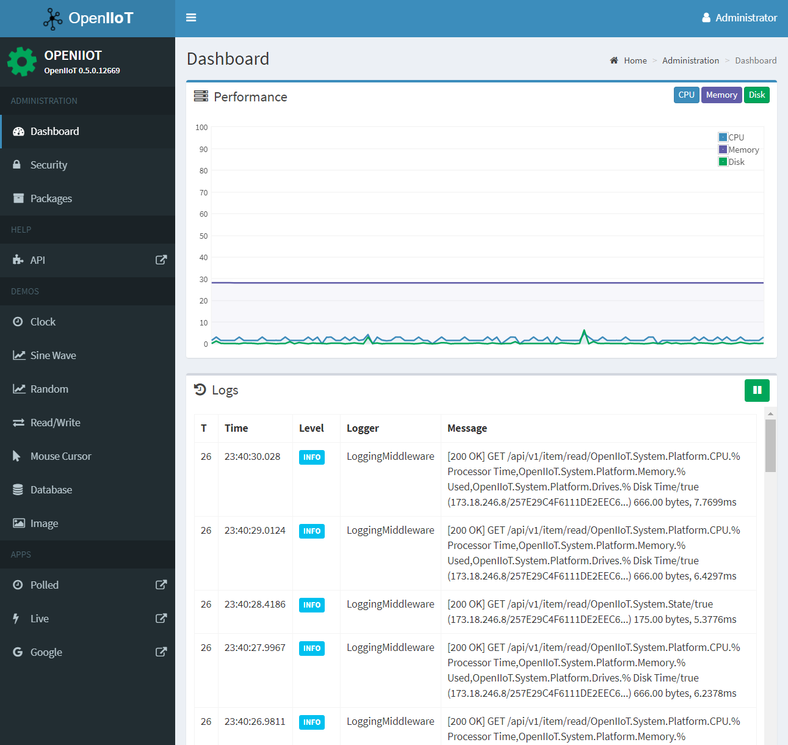
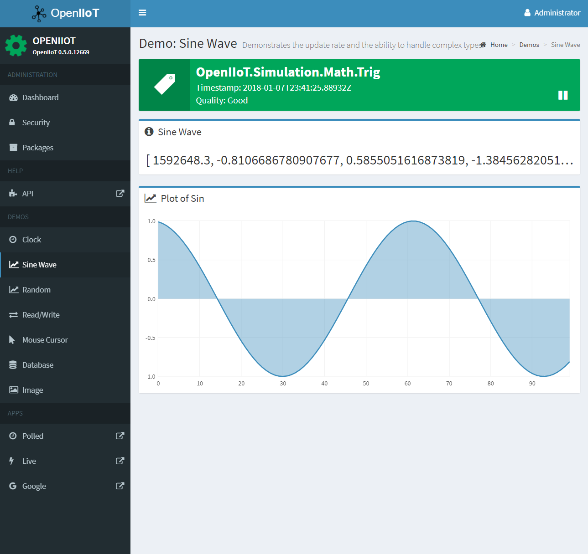

<h1>OpenIIoT</h1>

## About

OpenIIoT is a cross-platform (via Mono) application platform for the (Industrial) Internet of Things written in C#.  The code in this repository is a work in progress and is presently on hiatus.

Feel free to email <info@openiiot.org> with any questions.

If you'd like to demo the front end, skip to the [demo](#demo) section.

## Concept

The concept is straightforward; the application gathers data from industrial control system assets and moves it somewhere else.  Where the application can get data from, as well as where it can send the data to, is determined by the available plugins.  

The following concept diagram outlines the functionality from a high level:

 

Plugins come in the form of .NET binaries, and capabilities are extended by the implementation of one or more interfaces (documentation TBD).  The interfaces implemented by plugins determine the functionality, but generally plugins will fall into either the category of "connector", which allows the application to retrieve data from various places, or "endpoint", which allows the application to send data.

Also pluggable are repository interfaces, however this is not shown in the concept diagram.  Repository plugins are essentially database abstractions.

In addition to Endpoints, the application provides a number of core services, primarily a robust set of RESTful APIs, a real-time data streaming engine (SignalR), and a static file server.  This functionality allows for user-defined web applications to be hosted by the application, and in turn these application consume the available APIs to display and manipulate data.  Future functionality includes MQTT and probably an OPC-UA server.

## Architecture

Up-to-date documentation for the software architecture isn't available, however the present state pretty closely reflects the original concept designed some time around 2010:

Notable changes are the addition of SignalR and the static web server, the abandonment of an ODBC interface, and the repositioning of the data model as the central element of the application.

The application wasn't imagined to be pluggable at the time this was made, so there's a bunch of architectural details around that as well.

## Demo

A recent build of the application has been deployed to an AWS EC2 instance for demo purposes.  The demo can be accessed at [http://demo.openiiot.org](http://demo.openiiot.org); use 'admin' for both the username and password, without quotes.

Note that there's nothing else on this server but the demo application, and the application hasn't been secured.  If you find that something isn't working properly or has perhaps been defaced, please create an [issue](https://github.com/OpenIIoT/OpenIIoT.Core/issues) or email <info@openiiot.org>.

## Screenshots

### Login

### Dashboard

The application takes a hands-off approach to performance; due to the range of hardware upon which it will run (primarily single-board computers like the Raspberry Pi) and the variety of things that can be done with it, whoever is responsible for configuration needs to keep an eye on the performance characteristics and offload functionality if needed.

The dashboard provides administrators with a quick view of the present CPU, memory and hard drive usage of the host machine.  Additional metrics such as swap (*nix) and paging and Ethernet activity will probably be added later.

Also available on the dashboard are real-time application logs.  These are presently full of API requests because the application is running with debug logging enabled.

### Sine Wave

The demo contains a few different examples of the types of data visualization that can be achieved; the most comprehensive of which is the Sine Wave graph.

This screen demonstrates the application streaming a real-time data item from the application, in this case an array, and displaying the data in a browser.

The current update rate at the back end is 50 milliseconds, and as can be seen in the browser the unbroken sine wave depicted in the graph illustrates that neither the back end nor the real-time data pipe drops frames (on most systems, under most conditions).

## Documentation

Documentation is updated somewhat regularly and can be found at [http://openiiot.org](http://openiiot.org).
